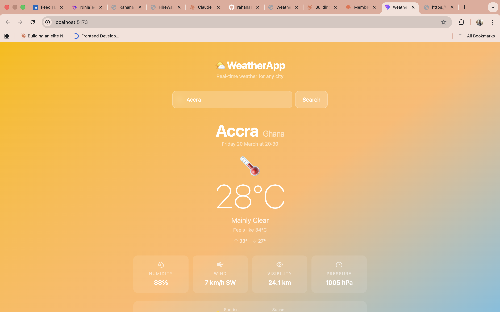

# 🌦️ WeatherApp

A real-time weather dashboard built with React, TypeScript, Vite, and Tailwind CSS.
Search any city in the world and get live weather data with a beautiful UI that
dynamically changes based on current conditions.


---

## 📸 Screenshots



---

## ✨ Features

- 🌍 **Search any city** worldwide by name
- 🌡️ **Current conditions** — temperature, feels like, min/max
- 💧 **Humidity, wind speed & direction, visibility, pressure**
- 🌅 **Sunrise & sunset** times
- 📅 **5-day forecast** with daily high/low temperatures
- 🎨 **Dynamic backgrounds** that change with the weather condition
- ⚡ **Parallel API calls** via Promise.all for fast load times
- 💅 **Glassmorphism UI** with smooth 1s background transitions
- ⚠️ **Full error handling** — invalid cities and network failures
- 🔑 **No API key required** — powered by Open-Meteo (free forever)

---

## 🖥️ Tech Stack

| Layer     | Technology       |
| --------- | ---------------- |
| Framework | React 18         |
| Language  | TypeScript 5     |
| Bundler   | Vite 8           |
| Styling   | Tailwind CSS v4  |
| Icons     | Lucide React     |
| Data      | Open-Meteo API   |
| HTTP      | Native Fetch API |

---

## 📁 Project Structure

```
weather-app/
├── src/
│   ├── components/
│   │   ├── SearchBar.tsx       # City search input with glassmorphism styling
│   │   ├── WeatherCard.tsx     # Main current weather display
│   │   ├── ForecastCard.tsx    # 5-day forecast strip
│   │   ├── WeatherDetail.tsx   # Reusable stat tile (humidity, wind, etc.)
│   │   └── LoadingSpinner.tsx  # Animated loading state
│   ├── hooks/
│   │   └── useWeather.ts       # Custom hook — all fetch logic lives here
│   ├── types/
│   │   └── weather.ts          # TypeScript interfaces for API responses
│   ├── utils/
│   │   └── weatherHelpers.ts   # Pure functions — conversions and helpers
│   ├── App.tsx                 # Root component — wires everything together
│   └── index.css               # Tailwind import
└── vite.config.ts              # Vite + Tailwind configuration
```

---

## 🚀 Getting Started

### Prerequisites

- Node.js 18+
- No API key needed — Open-Meteo is completely free

### Installation

1. **Clone the repository**

```bash
   git clone https://github.com/Rahana23/WeatherApp.git
   cd WeatherApp
```

2. **Install dependencies**

```bash
   npm install
```

3. **Start the development server**

```bash
   npm run dev
```

4. **Open your browser**
   Navigate to [http://localhost:5173](http://localhost:5173)

---

## 🏗️ Architecture Decisions

**Custom Hook (`useWeather`)** — all API logic is isolated in one place. Components stay clean and don't need to know how data is fetched.

**Types first** — all TypeScript interfaces are defined in `src/types/weather.ts` before any components are written, giving full autocomplete and type safety throughout.

**Pure utility functions** — all data transformations (WMO codes → conditions, formatting, compass directions) live in `src/utils/weatherHelpers.ts` — easy to test and reuse.

**Four UI states** — every screen state is handled explicitly: loading, error, empty, and data. No blank screens or stale data.

**Two-step geocoding** — city name is first converted to coordinates via Open-Meteo's geocoding API, then weather is fetched using lat/lon. This gives accurate results for any city worldwide.

---

## 👤 Author

**Rahana** — learning to build with React & TypeScript

- GitHub: [@Rahana23](https://github.com/Rahana23)
